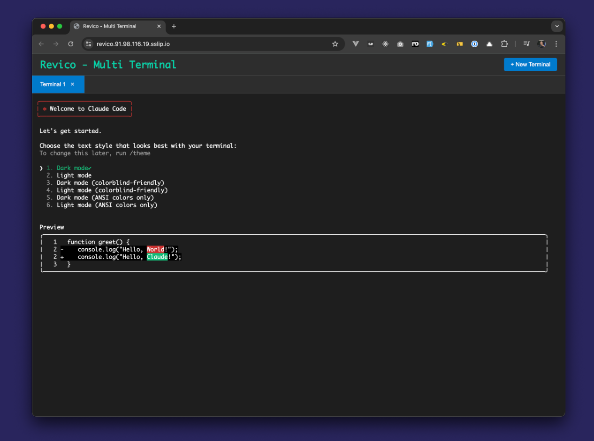

# Remote Vibe Coding (Revico)

Revico starts with the desire to be able to tinker with agentic coding, while on the go.

Not only on the go, but on a real system, with freedom and flexibility!
Interact in a browser, mobile, or at the desk as well, ofc.

Check docs at: [Remote Vibe Coding](https://jpat.dev/remote-vibe-coding)
